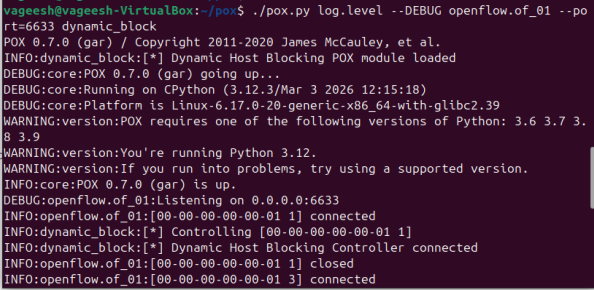
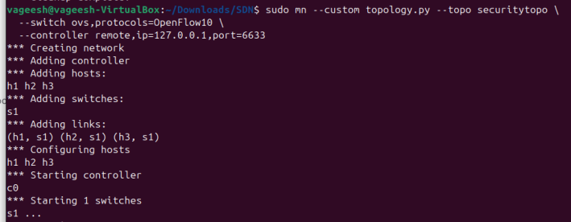
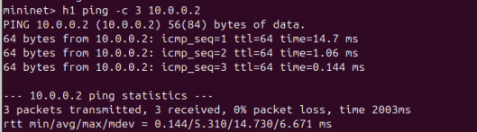
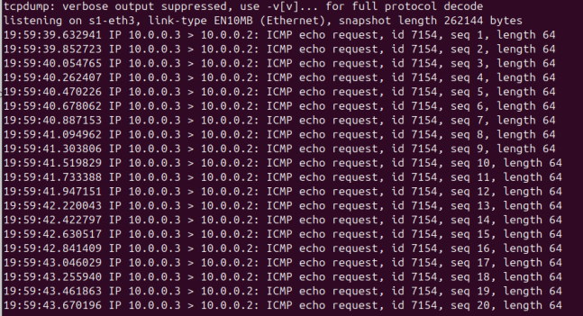
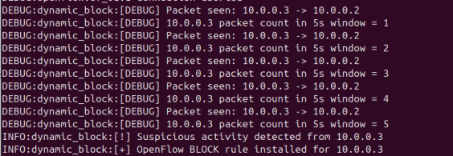
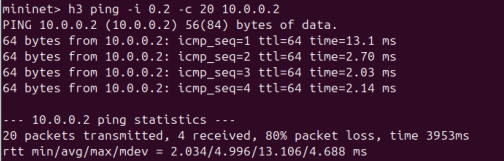
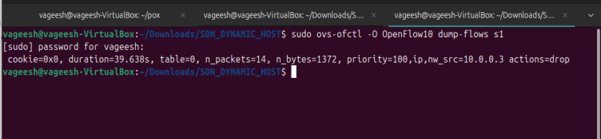

# SDN-Based Dynamic Host Blocking 

## Overview
This project implements a **Dynamic Host Blocking System** using **Software Defined Networking (SDN)** with Mininet, POX, and OpenFlow.
The controller observes host traffic behavior in real time and dynamically blocks suspicious sources by installing OpenFlow drop rules.

---

## Project Goal
To dynamically block hosts based on traffic behavior using a programmable SDN controller.

---

## Expected Outcomes
- Detect suspicious activity
- Install blocking rules
- Verify blocking behavior
- Log security events

---

## Problem Context
In conventional networks, responding to malicious or high-rate traffic is often manual and delayed. SDN provides centralized visibility and policy control, making dynamic and automated enforcement possible.

This project addresses:
> **Automatic detection of high-rate suspicious host traffic and dynamic host blocking using OpenFlow.**

---

## Execution Workflow

### 1) Launch POX
```bash
cd ~/pox
./pox.py log.level --DEBUG openflow.of_01 --port=6633 dynamic_block
```

POX console output:



### 2) Launch Mininet Topology
```bash
sudo mn --custom topology.py --topo securitytopo --switch ovs,protocols=OpenFlow10 --controller remote,ip=127.0.0.1,port=6633
```

Mininet topology view:



### 3) Baseline Traffic (Before Block)
```bash
mininet> h1 ping -c 3 10.0.0.2
```

Before blocking result:



### 4) Suspicious Traffic Simulation
```bash
mininet> h3 ping -i 0.2 -c 20 10.0.0.2
```

Packet capture output:



Controller detection output:



Post-block behavior result:



### 5) Confirm Installed Flow Rules
```bash
sudo ovs-ofctl -O OpenFlow10 dump-flows s1
```

Flow table output:



---

## Detection Parameters
Configured controller values:

- `THRESHOLD = 8`
- `WINDOW = 3` seconds
- `BLOCK_TIME = 45` seconds
- `WHITELIST = {"10.0.0.2"}`

When a non-whitelisted source crosses the packet threshold inside the time window, the controller adds a drop flow for that IP. The rule is removed automatically after block timeout.

---

## Topology Details
- `h1`: normal client (`10.0.0.1`)
- `h2`: server and whitelisted node (`10.0.0.2`)
- `h3`: attacker simulation host (`10.0.0.3`)
- `h4`: extra host (`10.0.0.4`)
- `s1`: OpenFlow switch

Topology view:


---

## Key Features
- Custom **4-host, 1-switch** Mininet topology
- Custom event-driven logic in **POX**
- OpenFlow **PacketIn** handling
- Per-source traffic behavior tracking
- Threshold-based suspicious traffic detection
- Runtime installation of **drop** rules
- Temporary block with automatic unblock after timeout
- Verification through:
  - `ping`
  - `ovs-ofctl`
  - `tcpdump` / Wireshark

---

## Tech Stack
- **Ubuntu / WSL**
- **Python 3**
- **Mininet**
- **POX Controller**
- **Open vSwitch**
- **OpenFlow 1.0**
- **tcpdump / Wireshark**
- **Git & GitHub**

---

## Event Logging
Controller events are appended in `events.json`.

Sample entries:

```json
{"ip": "10.0.0.3", "event": "suspicious_traffic", "count": 8, "threshold": 8, "window_sec": 3, "action": "blocked", "verified": true}
{"ip": "10.0.0.3", "event": "unblocked", "action": "removed"}
```

---

## Repository Layout

```text
SDN-MININET-DYNAMIC-HOST-BLOCKING-SYSTEM-main/
|-- images/
|   |-- beforeblocking.png
|   |-- blockdetection.png
|   |-- blockmininet.png
|   |-- controller_pox.png
|   |-- flowtable.png
|   |-- tcptraffic.png
|   `-- topolgy.png
|-- .gitignore
|-- README.md
|-- dynamic_block.py
|-- events.json
`-- topology.py
```

---

## Final Note
This implementation highlights how SDN can provide programmable and responsive security control in a practical network scenario.
By integrating Mininet for emulation, POX for centralized logic, and OpenFlow for rule enforcement, the system can react to suspicious traffic patterns in real time.
The behavior-based detection approach helps identify abnormal host activity and apply timely mitigation.
Overall, the project demonstrates that dynamic host blocking can be achieved effectively through software-defined control.

---
